# Curating the FLEURS Dataset with NeMo Curator

Download a [FLEURS](https://huggingface.co/datasets/google/fleurs) split, run ASR, and filter by WER — all in a single pipeline.

## Overview

FLEURS contains spoken utterances across 100+ languages. This pipeline downloads a split, transcribes it with a NeMo ASR model, scores WER against the reference, computes durations, and writes a filtered JSONL manifest.

### Pipeline flow

```mermaid
flowchart LR
    A["CreateInitialManifestFleursStage<br/><small>HF download + JSONL</small>"] --> B["InferenceAsrNemoStage<br/><small>GPU transcription</small>"]
    B --> C["GetPairwiseWerStage<br/><small>WER computation</small>"]
    C --> D["GetAudioDurationStage<br/><small>duration calc</small>"]
    D --> E["PreserveByValueStage<br/><small>wer_pct ≤ threshold</small>"]
    E --> F["AudioToDocumentStage<br/><small>AudioTask → Doc</small>"]
    F --> G["JsonlWriter<br/><small>write JSONL</small>"]
```



## Prerequisites

- Python 3.11+
- NeMo Curator installed (see [installation guide](https://docs.nvidia.com/nemo/curator/latest/admin/installation.html))
- **GPU**: Recommended for ASR inference. Minimum ~4 GB VRAM for FastConformer/Parakeet models. Set `stages.1.resources.gpus=0` for CPU fallback (10–50x slower).
- **System packages**: None

```bash
# GPU (recommended)
uv sync --extra audio_cuda12

# CPU only
uv sync --extra audio_cpu
```

## Dataset

| Property | Value |
|---|---|
| **Source** | [google/fleurs](https://huggingface.co/datasets/google/fleurs) on HuggingFace |
| **Format** | WAV audio + text transcriptions |
| **Size** | ~50 MB per language split (auto-downloaded) |
| **License** | [CC BY 4.0](https://creativecommons.org/licenses/by/4.0/) |
| **Auto-download** | Yes — handled by `CreateInitialManifestFleursStage` |

## Quick start

Run the pipeline via Hydra (from Curator repo root):

```bash
python tutorials/audio/fleurs/main.py \
  --config-path . \
  --config-name pipeline \
  raw_data_dir=./example_audio/fleurs
```

Defaults: Armenian (`hy_am`) dev split, WER threshold **5.5%** (same as the nightly benchmark).

## Usage

### Hydra overrides

Override values without editing `pipeline.yaml`:

```bash
python tutorials/audio/fleurs/main.py \
  --config-path . \
  --config-name pipeline \
  raw_data_dir=./example_audio/fleurs \
  data_split=dev \
  lang=en_us \
  stages.1.model_name=nvidia/parakeet-tdt-0.6b-v2 \
  wer_threshold=25.0 \
  backend=ray_data
```

| Override | Stage / setting |
|---|---|
| `raw_data_dir` | Workspace parent dir (downloads go to `<raw_data_dir>/<lang>/`; output to `<raw_data_dir>/result/<lang>/`) |
| `lang` | FLEURS language code (e.g. `en_us`, `hy_am`) |
| `data_split` | FLEURS split: `train`, `dev`, or `test` |
| `wer_threshold` | Keep samples with `wer_pct ≤` this value (default: `5.5`) |
| `stages.1.model_name` | NeMo ASR model for inference |
| `stages.1.resources.gpus` | GPUs for ASR (`0` for CPU) |
| `backend` | `xenna` (default) or `ray_data` |

FLEURS language codes follow the dataset convention (e.g., `en_us`, `fr_fr`, `hy_am`). See the [dataset card](https://huggingface.co/datasets/google/fleurs) for the full list. Use the corresponding NeMo ASR model for your target language.

### Choosing a backend

| Backend | Description | When to use |
|---|---|---|
| `xenna` | Default. Cosmos-Xenna streaming engine with automatic worker allocation. | Most workloads, CI/nightly benchmarks. |
| `ray_data` | Built on Ray Data `map_batches`. | Development, machines without Xenna GPU support. |

Both backends run on top of Ray. `main.py` uses `RayClient` to manage the Ray cluster lifecycle (start/stop, port allocation, dashboard). `RayClient` is started before creating the executor and stopped in a `finally` block so the cluster is always cleaned up.

## Pipeline stages

### 1. `CreateInitialManifestFleursStage`

Downloads the FLEURS split from HuggingFace (if not cached under `<raw_data_dir>/<lang>/`) and emits one `AudioTask` per utterance with `audio_filepath` and `text`.

### 2. `InferenceAsrNemoStage`

Runs a NeMo ASR model on each audio file (GPU-accelerated). Adds `pred_text` to the task data.

### 3. `GetPairwiseWerStage`

Computes word error rate between `text` (reference) and `pred_text` (predicted). Adds `wer_pct` as a percentage (0–100).

### 4. `GetAudioDurationStage`

Reads the audio file and computes its duration in seconds. Adds `duration`.

### 5. `PreserveByValueStage`

Keeps only tasks where `wer_pct ≤ wer_threshold`. Tasks exceeding the threshold are dropped.

### 6. `AudioToDocumentStage` + `JsonlWriter`

Converts surviving `AudioTask` objects to `DocumentBatch` format and writes JSONL to `${raw_data_dir}/result/${lang}/`.

## Parameters and tuning

### WER threshold

WER (Word Error Rate) measures transcription accuracy on a 0–100 scale: 0 = perfect match, 100 = every word wrong. Values above 100 are possible when insertions outnumber deletions.

The default **`wer_threshold` of 5.5** matches the nightly FLEURS benchmark and the tutorial notebook. It keeps high-quality transcriptions when the ASR model matches the target language (e.g. `hy_am` + `stt_hy_fastconformer_hybrid_large_pc`).

**Recommended thresholds by use case:**

| Use case | Threshold | Rationale |
|---|---|---|
| Benchmark / high-quality curation | 5.5 (default) | Aligns with nightly regression runs |
| ASR evaluation | 10–25 | Reasonably accurate transcriptions |
| ASR fine-tuning (high recall) | 25–50 | Keeps noisy-but-usable training data |
| Tutorial / demo (any language+model) | 50–75 | Maximizes output for mismatched pairs |

Lower thresholds produce cleaner but smaller datasets. If output is empty, increase `wer_threshold` or use a better-matching ASR model.

### Other parameters

| Parameter | Range | Effect |
|---|---|---|
| `stages.1.resources.gpus` | 0–N | 0 = CPU-only (slow). 1 = single GPU (recommended). |
| `stages.0.batch_size` | 1–64+ | Fan-out stage batch size; increase for higher throughput on high-VRAM GPUs. Default is 4. |

## Output format

Results are written as JSONL to `${raw_data_dir}/result/${lang}/`. Each line contains:

```json
{
  "audio_filepath": "relative/path/to/audio.wav",
  "text": "reference transcription from FLEURS",
  "pred_text": "predicted transcription from ASR model",
  "wer_pct": 12.5,
  "duration": 4.21
}
```

| Field | Type | Description |
|---|---|---|
| `audio_filepath` | string | Relative path to the WAV file |
| `text` | string | Ground-truth transcription from the FLEURS dataset |
| `pred_text` | string | ASR model's predicted transcription |
| `wer_pct` | float | Word Error Rate (0–100) between `text` and `pred_text` |
| `duration` | float | Audio duration in seconds |

## Performance

### Timing estimates

| Dataset | Samples | Wall-clock time | Hardware |
|---|---|---|---|
| `hy_am` dev split | ~200 | ~2–5 minutes | 1x A100 GPU |
| `en_us` dev split | ~400 | ~5–10 minutes | 1x A100 GPU |
| Any split (CPU fallback) | ~200 | ~30–60 minutes | 8-core CPU |

Most time is spent in ASR inference (Stage 2). Download, WER, and duration stages are near-instant.

### Expected filtering ratios

With default `wer_threshold=5.5` and a well-matched model:
- **~90–100% pass rate** for the default `hy_am` + FastConformer pair

With a permissive `wer_threshold=75`:
- Most language+model pairs: **>90% pass rate**
- Mismatched language/model: **0–30% pass rate**

If your output is empty, increase `wer_threshold` or use an ASR model that supports the target language.

## Composability

The FLEURS stages can be composed with other NeMo Curator audio stages:

```python
from nemo_curator.backends.xenna import XennaExecutor
from nemo_curator.core.client import RayClient
from nemo_curator.pipeline import Pipeline
from nemo_curator.stages.audio.datasets.fleurs.create_initial_manifest import CreateInitialManifestFleursStage
from nemo_curator.stages.audio.inference.asr.asr_nemo import InferenceAsrNemoStage
from nemo_curator.stages.audio.metrics.wer import GetPairwiseWerStage

pipeline = Pipeline(
    name="fleurs-custom",
    stages=[
        CreateInitialManifestFleursStage(lang="en_us", split="dev", raw_data_dir="./data"),
        InferenceAsrNemoStage(model_name="nvidia/parakeet-tdt-0.6b-v2"),
        GetPairwiseWerStage(text_key="text", pred_text_key="pred_text", wer_key="wer_pct"),
    ],
)

ray_client = RayClient()
ray_client.start()
try:
    pipeline.run(XennaExecutor())
finally:
    ray_client.stop()
```

## Troubleshooting

| Problem | Cause | Fix |
|---|---|---|
| Output directory already exists | Previous run left `${raw_data_dir}/result/${lang}/` | Remove the directory before re-running |
| OOM during ASR inference | GPU VRAM too small for model + batch | Reduce `stages.0.batch_size` in `pipeline.yaml` or use a smaller model |
| CPU inference very slow | CPU is 10–50x slower than GPU | Set `stages.1.resources.gpus=1`; CPU is only for testing |
| Empty output JSONL | `wer_threshold` too strict for the model+language pair | Increase `wer_threshold` or use a better-matching ASR model |
| HuggingFace download fails | Network/auth issue | Check connectivity; some splits may need `huggingface-cli login` |
| Wrong language code | Typo in `stages.0.lang` | Consult the [FLEURS dataset card](https://huggingface.co/datasets/google/fleurs) for valid codes |
| SIGSEGV / actor crash during model load | gRPC thread-safety race | See [Known Issues](../README.md#known-issues) — set `OTEL_SDK_DISABLED=true` |

## License

FLEURS is released under [CC BY 4.0](https://creativecommons.org/licenses/by/4.0/). See the [dataset card](https://huggingface.co/datasets/google/fleurs) for full terms.
